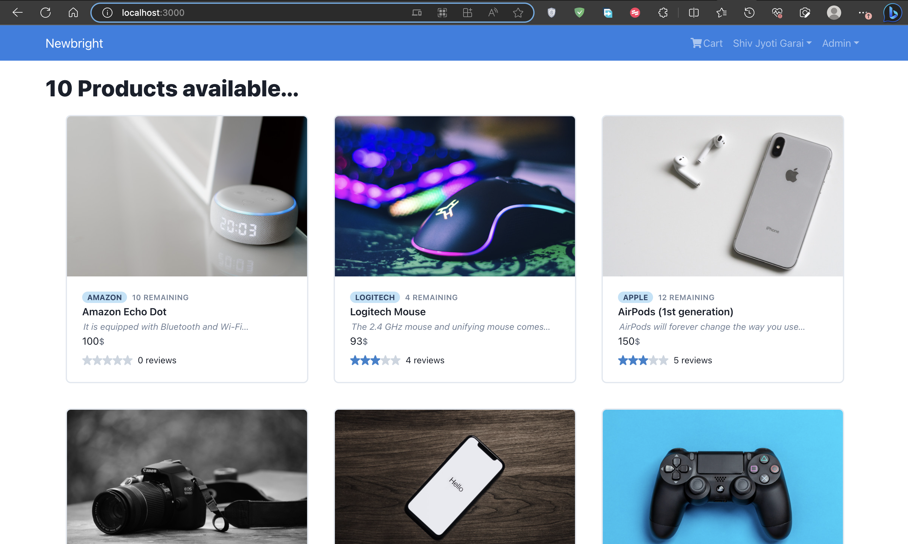
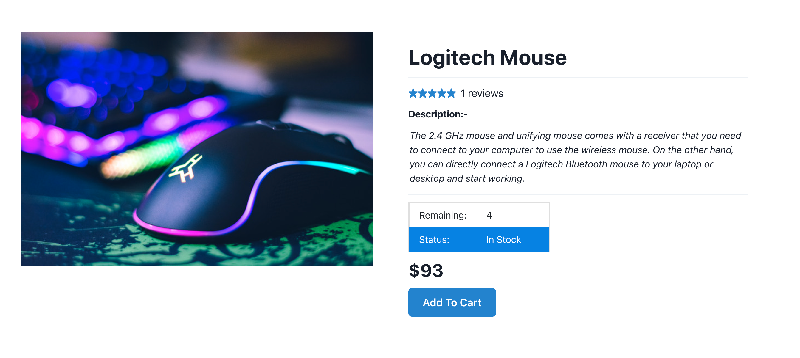
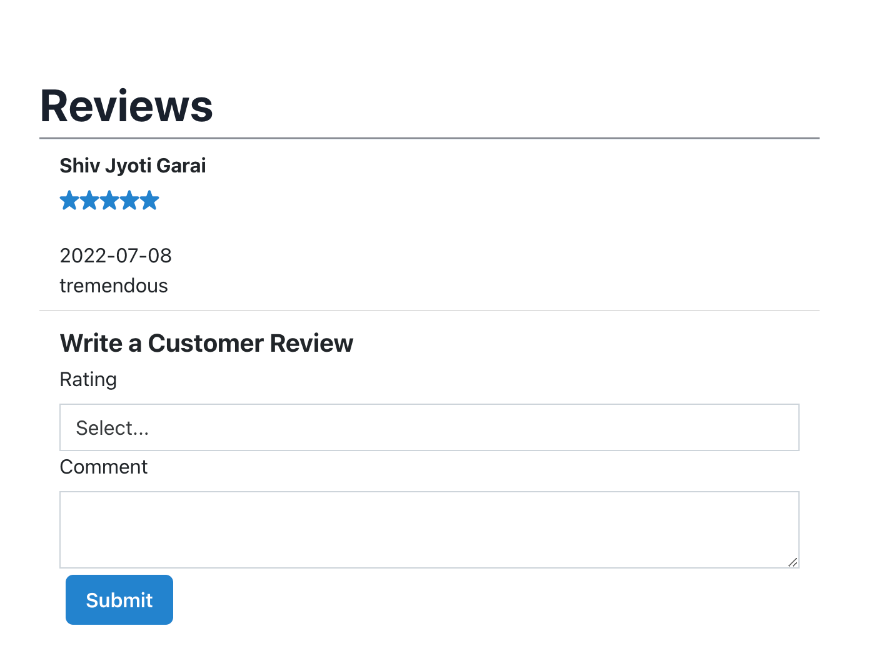
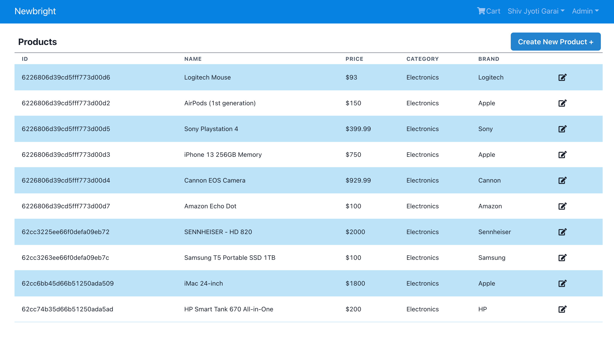
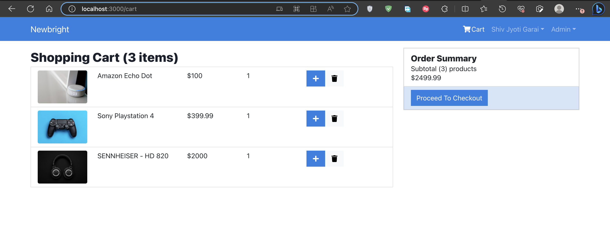
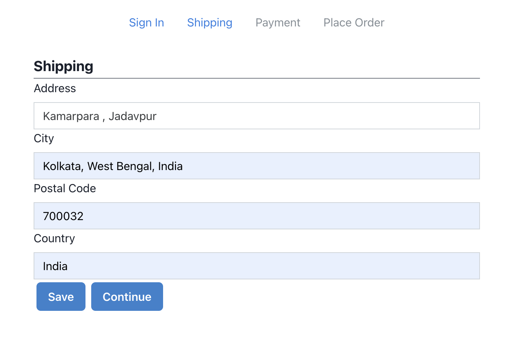
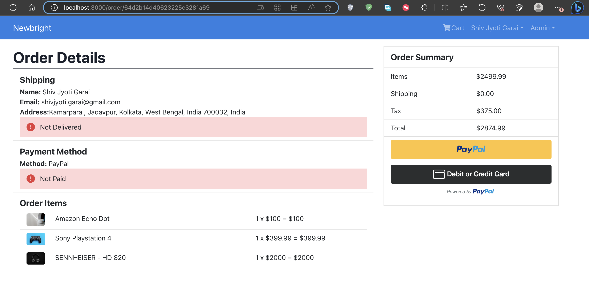
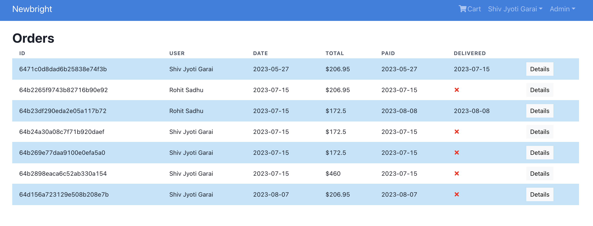

# E Commerce Platform MERN

A full stack e-commerce website built using the mern stack designed with Chakra-UI and React Bootstrap.

# Images

Home Page :-



Product Page :-



Reviews :-



Product List :-



Cart :-



Shipping Details :-



Order Details :-



Order List :-



</br>
# Build Locally

```
1. npm install

2. npm run dev
```

### `npm install`

Downloads the npm packages

### `npm run dev`

Runs the app in the development mode.\
Open [http://localhost:3000](http://localhost:3000) to view it in your browser.

The page will reload when you make changes.\
You may also see any lint errors in the console.

# Features

- Reviews and Rating of products
- User Profile and the orders placed by him/her
- Admin management of products orders etc
- Update Profile name/email
- Detailed checkout process
- Payment Gateway
